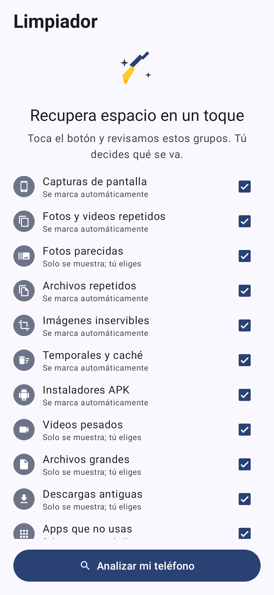
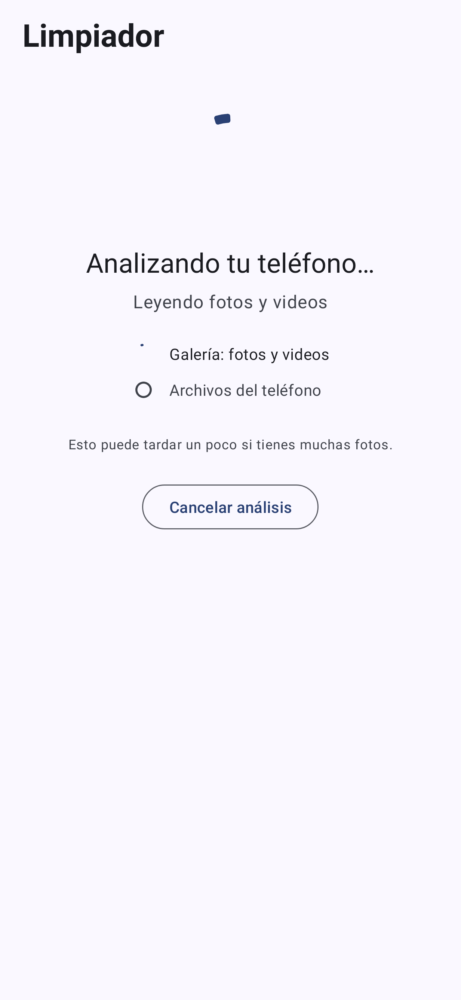
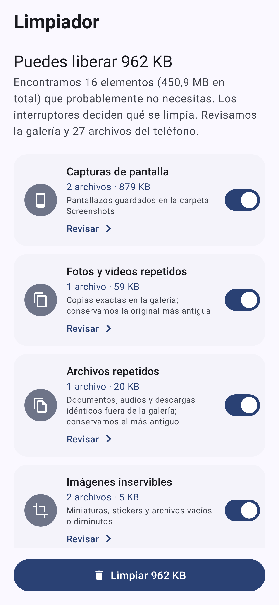
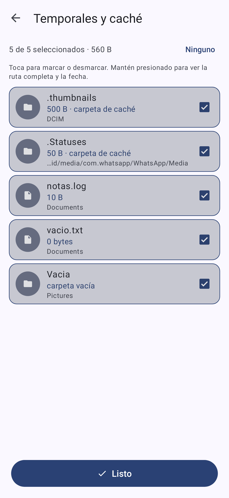
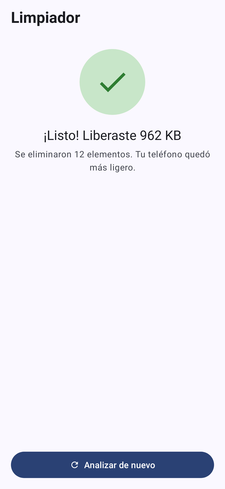

# Limpiador · liberador de espacio para Android

App Android (Kotlin, Material 3 con colores dinámicos de Material You) que analiza el teléfono completo y propone liberar espacio en once grupos:

| Grupo | Criterio | ¿Preseleccionado? | Requiere |
|---|---|---|---|
| Capturas de pantalla | carpeta `Screenshots`/`Capturas` o nombre `Screenshot_*` | sí | fotos |
| Fotos y videos repetidos | en la galería: mismo tamaño → mismos primeros 64 KB → mismo SHA-256 (copias idénticas); se conserva el más antiguo | sí | fotos |
| Fotos parecidas | huella perceptual dHash de cada foto comparada con todas: ≤4 bits entre fotos cualesquiera (reenvíos, otra carpeta u otra compresión) o ≤10 bits dentro de una ráfaga (misma carpeta, ≤10 s); se conserva la más grande | no | fotos |
| Archivos repetidos | fuera de la galería (documentos, audios, descargas ≥16 KB, no ocultos): mismo tamaño → mismos 64 KB → mismo SHA-256; se conserva el más antiguo | sí | todos los archivos |
| Imágenes inservibles | < 20 KB, lado mayor < 256 px o 0 bytes | sí | fotos |
| Temporales y caché | `*.tmp/.log/.bak/.part/.crdownload…`, carpetas `.thumbnails`, `.Statuses`, `cache`…, archivos vacíos, carpetas vacías | sí | todos los archivos |
| Instaladores APK | `*.apk/.apks/.xapk` | sí | todos los archivos |
| Videos pesados | ≥ 200 MB | no | fotos |
| Archivos grandes | ≥ 100 MB que no son fotos ni videos | no | todos los archivos |
| Descargas antiguas | en `Download/` desde hace más de 30 días | no | todos los archivos |
| Apps que no usas | sin abrir en 60 días, con tamaño app+datos+caché | no | datos de uso |

Más una sección **Más espacio** con el vaciado de **caché de todas las apps** (diálogo del sistema `ACTION_CLEAR_APP_CACHE`) y accesos directos para conceder los dos permisos opcionales.

**Cómo se elimina cada cosa**: fotos y videos pasan por `MediaStore.createDeleteRequest` (confirmación de Android y papelera de 30 días donde exista); los archivos y carpetas se borran de inmediato tras la confirmación de la app; las apps se desinstalan una por una con el diálogo del sistema. `Android/data` y `Android/obb` no se tocan: Android 11+ no los expone a apps de terceros, así que la caché interna de otras apps solo se vacía con la herramienta del sistema.

**Permisos**: la app funciona solo con el permiso de fotos (modo galería). «Acceso a todos los archivos» (`MANAGE_EXTERNAL_STORAGE`) y «Acceso a datos de uso» (`PACKAGE_USAGE_STATS`) se conceden en Ajustes y amplían el análisis; la app los explica y ofrece saltarlos.

## Cómo se usa

1. **Inicio**: anillo con el espacio usado/libre, la lista de los once grupos con una casilla cada uno (se recuerdan) y el botón «Analizar mi teléfono».
2. **Análisis**: indicador animado con progreso en vivo («Comparando repetidos 40 de 120», «12.340 archivos del teléfono revisados…») y botón «Cancelar análisis».
3. **Resultados**: titular «Puedes liberar X» y una tarjeta por grupo con ícono, cantidad, tamaño y un interruptor para incluirlo o no. Tocar la tarjeta abre la **revisión en cuadrícula**: miniaturas (foto, ícono del APK o de la app), toque para marcar/desmarcar, mantener presionado para ver la foto, la ruta y fecha del archivo o la información de la app; botón Todos/Ninguno. Debajo, la sección **Más espacio**.
4. **Limpiar**: botón fijo abajo con el tamaño a liberar → confirmación de la app → confirmación de Android → pantalla «¡Listo! Liberaste X».

Si el análisis corrió sin «Acceso a todos los archivos», los resultados lo dicen arriba con un aviso y un botón para activarlo; el subtítulo indica siempre el alcance («Revisamos la galería y N archivos del teléfono»).

## Instalar

1. Descarga `dist/limpiador-v2.7.apk` en el teléfono.
2. Ábrelo; Android pedirá permitir «instalar apps desconocidas» para el navegador o el gestor de archivos.
3. Al abrir la app, concede el permiso de fotos y videos y pulsa **Buscar archivos basura**.

Requiere **Android 11 o superior** (`minSdk 30`). El APK está firmado con la clave de desarrollo versionada en `keystore/debug.keystore` (no es un secreto): así el APK local y el de CI comparten firma y las actualizaciones se instalan encima sin desinstalar.

## Capturas (renderizadas por las pruebas)

| Inicio | Análisis | Resultados | Revisión | Listo |
|---|---|---|---|---|
|  |  |  |  |  |

## Pruebas

```bash
./gradlew testReleaseUnitTest   # Robolectric: Activities y layouts reales en la JVM
```

- `FileScannerTest`: almacenamiento falso en un directorio temporal (descargas viejas, APK, `.thumbnails`, `.Statuses` de WhatsApp, `.log`, archivo vacío, carpeta vacía, ZIP de 100 MB sparse, `Android/data` que debe saltarse). Verifica la clasificación y la preselección.
- `JunkScannerTest`: galería falsa (proveedor `media` simulado) con fotos normales, capturas, un duplicado byte a byte, un falso duplicado del mismo tamaño, miniaturas, un archivo vacío y un video pesado. Verifica la clasificación, la preselección y el progreso.
- `MainFlowTest`: flujo completo inicio → análisis → resultados (8 tarjetas + herramientas) → cuadrícula de fotos y lista de archivos (marcar, Todos/Ninguno, pulsación larga) → diálogo → borrado real de los archivos en disco → petición de borrado de la galería al sistema → pantalla Listo; y el caso «Solo la galería» + permiso denegado. Renderiza cada pantalla a PNG en `app/build/screenshots/` (modo gráfico nativo de Robolectric).

No sustituye una prueba en teléfono real: el diálogo de borrado de Android y las miniaturas reales solo se ven en un dispositivo.

## Compilar

```bash
cd android-cleaner
./gradlew assembleRelease        # → app/build/outputs/apk/release/app-release.apk
```

Necesita JDK 17+ y el Android SDK (platform 35, build-tools 35.0.0); `local.properties` con `sdk.dir=…` o la variable `ANDROID_HOME`. El workflow `.github/workflows/android-apk.yml` compila el APK en GitHub Actions y lo publica como artifact en cada cambio de esta carpeta.

## Estructura

```
app/src/main/kotlin/com/dgonzamat/limpiador/
  Model.kt             # Kind, Category, MediaFile, JunkItem, ScanProgress, ScanStore, formatSize
  ScanEngine.kt        # orquesta los tres escáneres; ganchos reemplazables en pruebas
  JunkScanner.kt       # galería (MediaStore): capturas, repetidos, minúsculas, videos pesados
  FileScanner.kt       # almacenamiento (File API): temporales, caché, vacíos, APK, descargas, grandes
  AppScanner.kt        # apps sin usar (UsageStatsManager + StorageStatsManager)
  MainActivity.kt      # inicio → permisos → análisis → resultados (tarjetas + herramientas) → limpieza mixta → listo
  CategoryActivity.kt  # revisión de una categoría en cuadrícula
  GridAdapter.kt       # celdas de la cuadrícula (selección, miniatura, etiqueta)
  Thumbnails.kt        # miniaturas de MediaStore con caché LRU
  SquareCardView.kt    # MaterialCardView cuadrada para la cuadrícula
  LimpiadorApp.kt      # activa los colores dinámicos (Material You)
```

## Límites conocidos

- La caché interna de otras apps (`Android/data`) no es accesible para apps de terceros en Android 11+; se vacía con la herramienta del sistema que la app enlaza.
- «Duplicado» significa copia byte a byte. Dos fotos casi iguales (ráfaga, recomprimida por WhatsApp) no se detectan.
- En Android 14+ con acceso parcial («seleccionar fotos») y sin «todos los archivos», solo se analizan las fotos elegidas.
- `ACTION_CLEAR_APP_CACHE` y el detalle de tamaño por app dependen del fabricante; si el teléfono no los ofrece, la app lo indica y enlaza a Ajustes › Almacenamiento.
