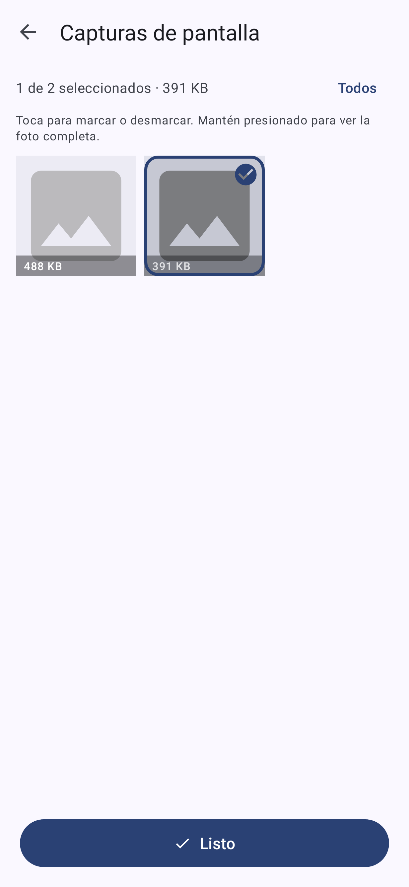

# Limpiador · app Android de archivos basura

App Android (Kotlin, Material 3 con colores dinámicos de Material You) que escanea la galería del teléfono y propone eliminar:

| Categoría | Criterio | ¿Preseleccionada? |
|---|---|---|
| Capturas de pantalla | carpeta `Screenshots`/`Capturas` o nombre `Screenshot_*` | sí |
| Fotos y videos duplicados | mismo tamaño **y** mismo SHA-256 (copias idénticas); se conserva la más antigua | sí |
| Imágenes minúsculas o vacías | < 20 KB, o lado mayor < 256 px, o 0 bytes (miniaturas, stickers, restos de caché) | sí |
| Videos grandes | ≥ 200 MB, solo para revisar | no |

**Nada se borra sin dos confirmaciones**: la de la app y la del diálogo del sistema (`MediaStore.createDeleteRequest`). En teléfonos con papelera de galería (Android 11+, según fabricante) los archivos van a la papelera 30 días.

## Cómo se usa

1. **Inicio**: anillo con el espacio usado/libre del teléfono y un solo botón, «Analizar mi galería».
2. **Análisis**: indicador animado con mensajes de progreso («Comparando repetidos 40 de 120»).
3. **Resultados**: titular «Puedes liberar X» y una tarjeta por categoría con ícono, cantidad, tamaño y un interruptor para incluirla o no. Tocar la tarjeta abre la **revisión en cuadrícula**: miniaturas grandes, toque para marcar/desmarcar, mantener presionado para ver la foto completa, botón Todos/Ninguno.
4. **Limpiar**: botón fijo abajo con el tamaño a liberar → confirmación de la app → confirmación de Android → pantalla «¡Listo! Liberaste X».

## Instalar

1. Descarga `dist/limpiador-v1.2.apk` en el teléfono.
2. Ábrelo; Android pedirá permitir «instalar apps desconocidas» para el navegador o el gestor de archivos.
3. Al abrir la app, concede el permiso de fotos y videos y pulsa **Buscar archivos basura**.

Requiere **Android 11 o superior** (`minSdk 30`). El APK está firmado con la clave de desarrollo versionada en `keystore/debug.keystore` (no es un secreto): así el APK local y el de CI comparten firma y las actualizaciones se instalan encima sin desinstalar.

## Capturas (renderizadas por las pruebas)

| Inicio | Resultados | Revisión | Listo |
|---|---|---|---|
|  |  |  |  |

## Pruebas

```bash
./gradlew testReleaseUnitTest   # Robolectric: Activities y layouts reales en la JVM
```

- `JunkScannerTest`: galería falsa (proveedor `media` simulado) con fotos normales, capturas, un duplicado byte a byte, un falso duplicado del mismo tamaño, miniaturas, un archivo vacío y un video pesado. Verifica la clasificación, la preselección y el progreso.
- `MainFlowTest`: flujo completo inicio → análisis → resultados → tarjetas e interruptores → cuadrícula (marcar, Todos/Ninguno, pulsación larga) → diálogo → petición de borrado al sistema → pantalla Listo; y el caso de permiso denegado. Renderiza cada pantalla a PNG en `app/build/screenshots/` (modo gráfico nativo de Robolectric).

No sustituye una prueba en teléfono real: el diálogo de borrado de Android y las miniaturas reales solo se ven en un dispositivo.

## Compilar

```bash
cd android-cleaner
./gradlew assembleRelease        # → app/build/outputs/apk/release/app-release.apk
```

Necesita JDK 17+ y el Android SDK (platform 35, build-tools 35.0.0); `local.properties` con `sdk.dir=…` o la variable `ANDROID_HOME`. El workflow `.github/workflows/android-apk.yml` compila el APK en GitHub Actions y lo publica como artifact en cada cambio de esta carpeta.

## Estructura

```
app/src/main/kotlin/com/dgonzamat/limpiador/
  Model.kt             # Category, MediaFile, JunkItem, ScanProgress, ScanStore, formatSize
  JunkScanner.kt       # consulta MediaStore y clasifica (solo lectura)
  MainActivity.kt      # inicio → análisis → resultados (tarjetas) → limpieza → listo
  CategoryActivity.kt  # revisión de una categoría en cuadrícula
  GridAdapter.kt       # celdas de la cuadrícula (selección, miniatura, etiqueta)
  Thumbnails.kt        # miniaturas de MediaStore con caché LRU
  SquareCardView.kt    # MaterialCardView cuadrada para la cuadrícula
  LimpiadorApp.kt      # activa los colores dinámicos (Material You)
```

## Límites conocidos

- Solo toca la galería (imágenes y videos vía MediaStore). No limpia caché de otras apps: Android no lo permite desde una app de terceros sin acceso total al almacenamiento.
- «Duplicado» significa copia byte a byte. Dos fotos casi iguales (ráfaga, recomprimida por WhatsApp) no se detectan.
- En Android 14+ con acceso parcial («seleccionar fotos») solo se analizan las fotos elegidas.
